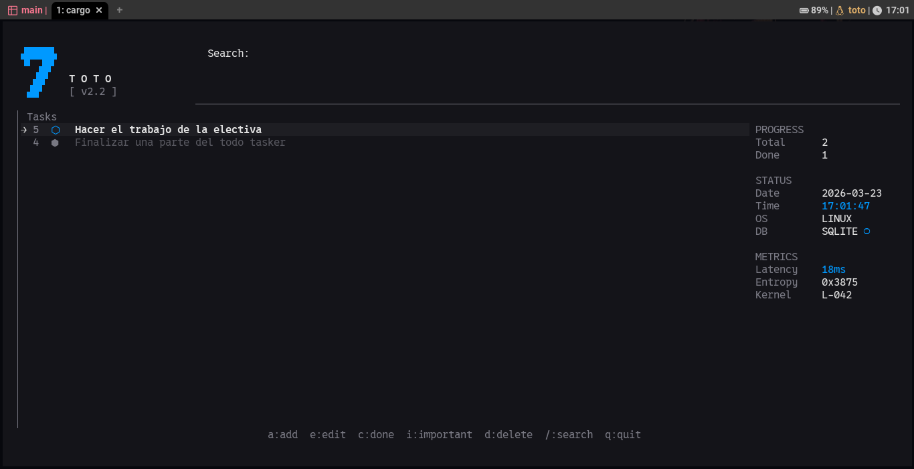

# TOTO // SYSTEM.V2

### A Cyber-Minimalist Todo Station for the Modern Terminal

**TOTO** is a high-performance, aesthetically-driven todo manager built with **Rust**, **Ratatui**, and **SQLite**. It combines a clinical "Cyber-Minimalist" TUI (Terminal User Interface) with a powerful CLI for those who prefer to stay in the command stream.

---



---

## ⬢ Key Features

* **Cyber-Minimalist Aesthetic**: A high-contrast, "hacker-lite" interface featuring:
  * **Live Telemetry**: Real-time status readouts (Date, Time, Latency, Entropy).
  * **Subtle Animations**: Pulsing focus indicators and scanning data sweeps.
  * **Brutalist Layout**: Geometric symbols (`⬡`, `⬢`, `→`) and sharp, architectural spacing.
* **Hybrid Interface**: Seamlessly switch between a full interactive TUI and quick-fire CLI commands.
* **SQLite Persistence**: Robust, stable storage using `todo.db`. No more corrupted JSON files.
* **Smart Search**: Real-time fuzzy-style filtering (press `/` in TUI).
* **Platform-Native Storage**: Automatically follows user directory standards:
  * **Linux**: `~/.local/share/toto`
  * **Windows**: `%AppData%\toto`
* **Safe Destruction**: Integrated confirmation protocols for data deletion.

---

## ⬡ Installation

Ensure you have [Rust and Cargo](https://rustup.rs/) installed.

1. **Clone the Repository**:

    ```bash
    git clone https://github.com/yourusername/toto.git
    cd toto
    ```

2. **Run the App**:

    ```bash
    cargo run
    ```

---

## ⬢ Usage Guide

### 1. Interactive TUI

Simply run `cargo run` without arguments to enter the **Tactical Control Interface**.

| Key | Action |
| :--- | :--- |
| `a` | **Add** a new process (task) |
| `e` | **Edit** an existing process |
| `c` / `Enter` | **Execute** (Toggle completion status) |
| `i` | **Prioritize** (Toggle importance) |
| `d` / `x` | **Wipe** (Delete with confirmation) |
| `/` | **Scan** (Start real-time search) |
| `Esc` | **Abort** popup or clear search |
| `q` | **Kill** (Safe shutdown) |

### 2. CLI Mode

Perform quick operations without leaving your shell.

* **List Tasks**: `cargo run -- --list` (or `-l`)
* **Add Task**: `cargo run -- --add "Fix the uplink"` (or `-a`)
* **Complete Task**: `cargo run -- --done 5` (or `-c`)
* **Toggle Priority**: `cargo run -- --important 5` (or `-i`)
* **Edit Task**: `cargo run -- --edit "5:Updated task text"` (or `-e`)
* **Remove Task**: `cargo run -- --remove 5` (or `-r`)

---

## ⬢ Technical Architecture

* **Backend**: [SQLite](https://www.sqlite.org/) via `rusqlite`
* **UI Framework**: [Ratatui](https://ratatui.rs/)
* **Event Handling**: [Crossterm](https://github.com/crossterm-rs/crossterm)

---

## ⬡ License

Distributed under the MIT License. See `LICENSE` for more information.
